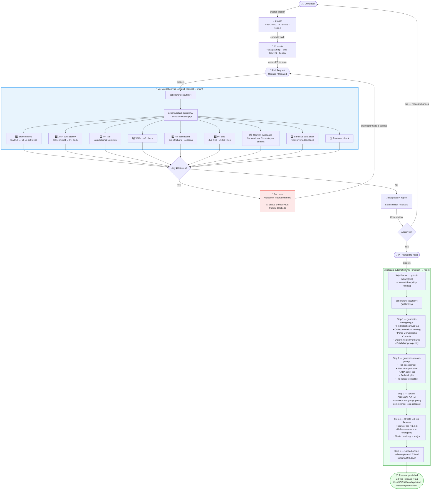

# PR → Release Lifecycle

This document describes the full lifecycle from branch creation to a published GitHub Release.

---

## End-to-End Flow



---

## Validation Check Reference

| # | Check | Trigger | Result on fail |
|---|-------|---------|---------------|
| 1 | **Branch name** | Any PR event | ❌ Blocks merge |
| 2 | **JIRA consistency** | Any PR event | ⚠️ Warning only |
| 3 | **PR title** | Edited / opened | ❌ Blocks merge |
| 4 | **WIP / draft** | Any PR event | ❌ Blocks merge |
| 5 | **PR description** | Edited / opened | ❌ (<50 chars) / ⚠️ (missing sections) |
| 6 | **PR size** | Push to PR | ❌ (>50 files) / ⚠️ (>1000 lines) |
| 7 | **Commit messages** | Push to PR | ⚠️ Warning only |
| 8 | **Sensitive data** | Push to PR | ❌ Blocks merge |
| 9 | **Reviewer assigned** | Any PR event | ⚠️ Warning only |

---

## Version Bump Rules

| Condition | Bump | Example |
|-----------|------|---------|
| Any commit with `!` or `BREAKING CHANGE:` | **Major** `v1.0.0 → v2.0.0` | API removed |
| Any `feat:` commit | **Minor** `v1.0.0 → v1.1.0` | New endpoint |
| Only `fix:` / `chore:` / etc. | **Patch** `v1.0.0 → v1.0.1` | Bug fix |
| No prior tag | First release | `v0.1.0` |

---

## Branch Naming Convention

```
<type>/<JIRA-TICKET>-<short-description>

Types:
  feat      → new feature
  fix       → bug fix
  chore     → maintenance / dependency updates
  docs      → documentation only
  refactor  → code restructure, no behavior change
  test      → tests only
  hotfix    → urgent production fix
  release   → release preparation branch

Examples:
  feat/PROJ-123-oauth-login
  fix/PROJ-456-null-pointer-user-service
  chore/PROJ-789-upgrade-node-20
  hotfix/PROJ-901-fix-prod-500-error
```

---

## Release Artifact Structure

After every merge to `main` a GitHub Release is created containing:

```
GitHub Release (tag: v1.2.3)
├── Release notes   ← generated from Conventional Commits
│
Workflow Artifact (90-day retention)
└── release-plan-v1.2.3.md
    ├── Summary
    ├── Changes Included (grouped by type)
    ├── Files Changed (table)
    ├── Risk Assessment (LOW / MEDIUM / HIGH)
    ├── Test Plan (from PR body)
    ├── Rollback Plan
    └── Pre-Release Checklist
```
